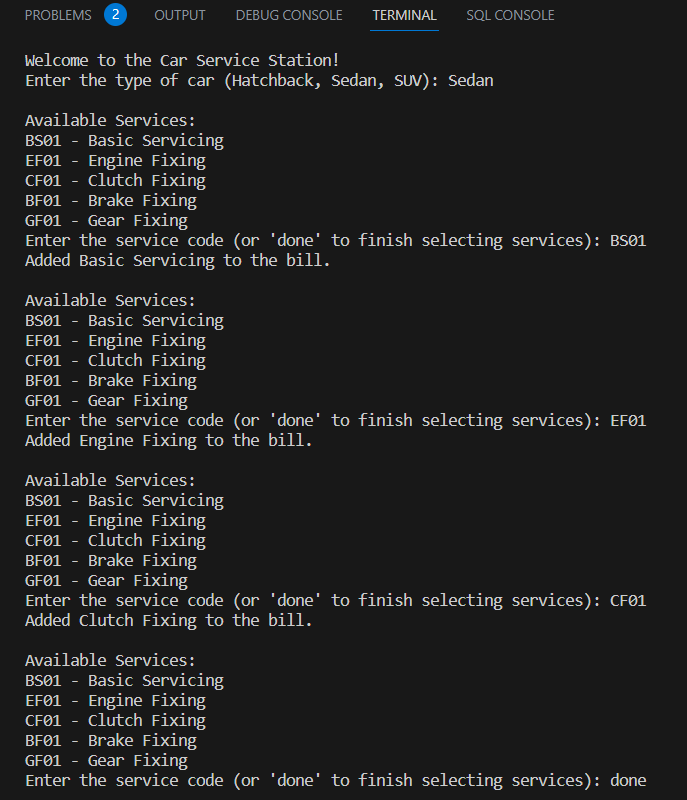
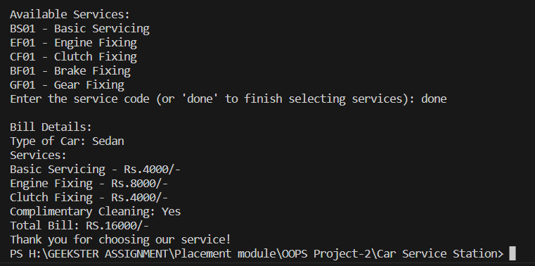

<h1 align="center"> Car Service Station ☕</h1>

The Car Service Station Software is a Java-based application designed to streamline the operations of a car service station. It automates the process of generating detailed bills for car services, catering to different car types (Hatchback, Sedan, SUV), and various service types (Basic Servicing, Engine Fixing, Clutch Fixing, Brake Fixing, and Gear Fixing).The Car Service Station Software simplifies the administrative tasks of a car service station, ensuring accurate billing and efficient customer service. It's a versatile and extensible solution for managing car servicing operations.


## **Features**

- **Car and Service Representation:** The software models cars and services using object-oriented programming (OOP) principles. It defines a `Car` class to represent different car types and a `Service` class to represent various service options. Each service is associated with a unique service code and pricing for different car types.

- **Bill Generation:** The core functionality revolves around generating detailed bills for customers based on their car type and selected services. The Bill class handles service addition, total bill calculation, and checks if the total bill exceeds ₹10,000 to provide complimentary cleaning.

- **Flexibility:** The software is designed to be flexible and extensible. You can easily add more car types and service options by creating new instances of the Car and Service classes, making it adaptable to the evolving needs of the service station.


## **Getting Started**

To run the Coffee Machine Simulator, follow these steps:

**1.** Ensure you have Java installed on your system.

**2.** Download the source code files or clone the repository.

**3.** Compile the Java source files using the following command:

```bash
  javac CarServiceStation.java
```
**4.** Run the application with the following command:
```bash
  java CarServiceStation
```
**5.** Follow the on-screen instructions to interact with the Car Service Station.
    
## **Usage**

Once the application is running, you will be presented with a services to choose from. Enter the corresponding deetails for the services you want to perform:





Follow the prompts and enter the required information as requested by each action.


## **OOPS Concepts Used**

These OOP principles help us to create well-structured, maintainable, and extensible code that models real-world entities effectively. They promote code reusability and modularity, making it easier to manage and enhance the software.

**1. Class:**

- All classes (`Car`, `Service`, `ServiceStation`, `CarServiceStation`) are examples of classes. Classes are blueprints or templates that define the structure and behavior of objects.

**2. Object:**

- In `CarServiceStation` class, we create objects of the ServiceStation, Car, and Service classes. Objects are instances of classes that represent real-world entities.

**3. Encapsulation:**

I have encapsulated the data and behavior of each class within the class itself. For example, the `Service` class encapsulates details about a service (e.g., code, name, prices), and the `ServiceStation` class encapsulates a list of services.

**4. Abstraction:**

Classes abstract away the implementation details from the user. For instance, the Service class abstracts the details of services and their pricing.


## **Contributing**

Contributions to the Car Service Station project are welcome! If you find any bugs or have suggestions for improvement, please open an issue or submit a pull request.


## **License**📝

This project is generated by [@Nikita Parate](https://github.com/nikitaparate193)


## **Acknowledgements**

The Car Service Station was developed as an example implementation based on OOPs concepts.


## **Disclaimer**✍️

This Car Service Station is a simplified program for educational purposes and does not represent a real service station or its functionalities.

